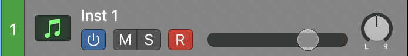
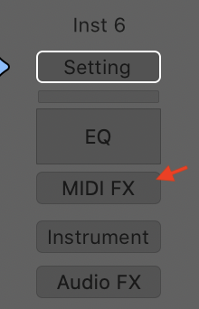
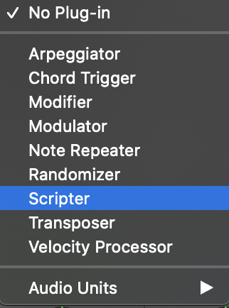
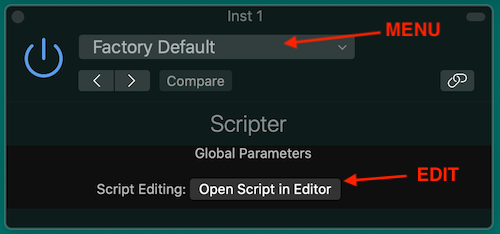
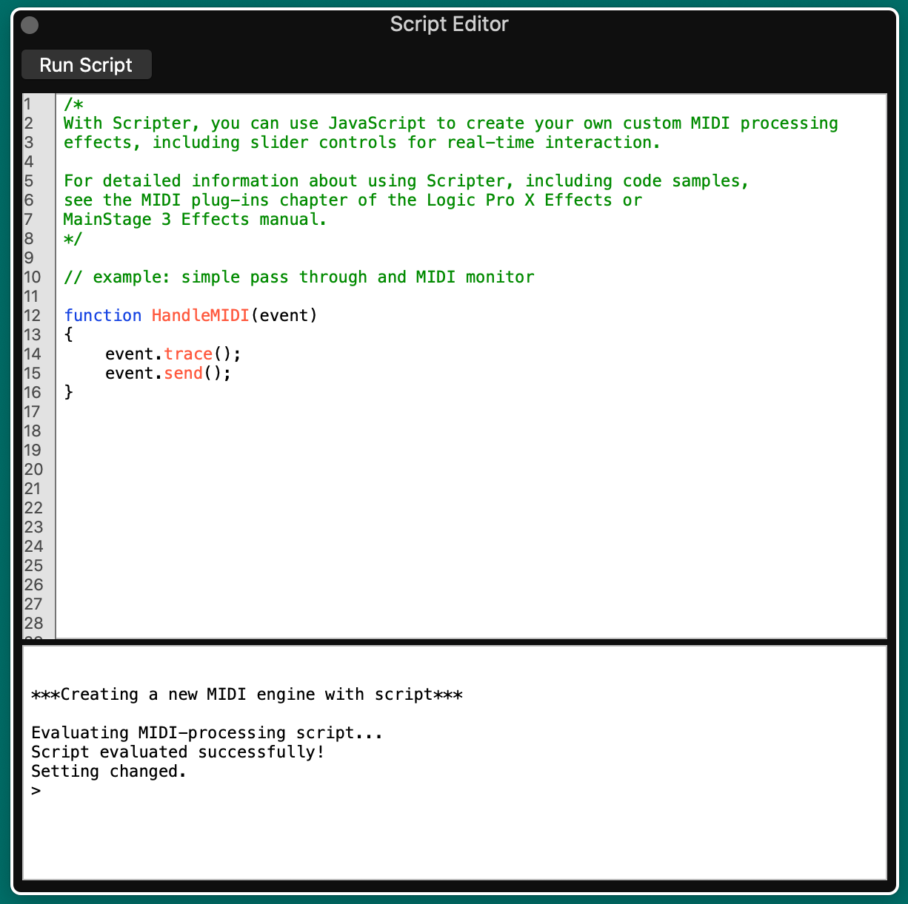
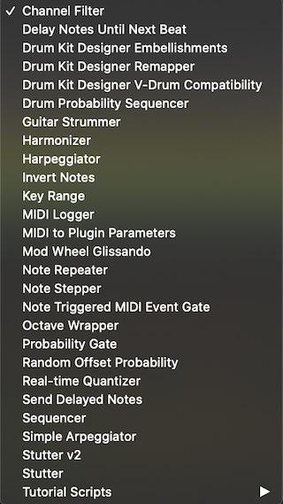
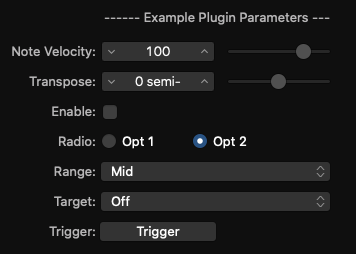

# Logic Pro Scripter Guide

This guide is oriented towards developers who want to use their dev knowledge to do good stuff with MIDI scripts. It assumes some knowledge of both Logic Pro and JavaScript.

The Scripter plug-in provides an interface between JavaScript code and the MIDI data of a Logic Pro channel. It allows users to create scripts that:

* Generate MIDI: like notes for chords, arpeggios. Or controls for modulation and effects.
* Transform MIDI: transpose notes, modify timing and rhythm
* Inject automation
* Control anything that MIDI can do


## Contents

* [Background](#background)
  * [Doc Status](#doc-status)
  * [Apple's Scripter Documentation](#apples-scripter-documentation)
  * [Getting Started](#getting-started)
  * [Apple's Tutorial Scripts](#apples-tutorial-scripts)
  * [Apple's Factory Scripts](#apples-factory-scripts)
  * [Files and Directories](#files-and-directories)
* [Few Differences for JavaScript Developers using Scripter](#few-differences-for-javascript-developers-using-scripter)
  * [Fragility](#fragility)
  * [Unlike a Browser or Node.js](#unlike-a-browser-or-nodejs)
  * [Standard JavaScript Capabilities](#standard-javascript-capabilities)
* [Global Variables](#global-variables)
* [Global Functions](#global-functions)
  * [`HandleMIDI(event)`](#handlemidievent)
  * [`ProcessMIDI(event)`](#processmidievent)
    * [Find your block duration](#find-your-block-duration)
  * [`Trace(obj)`](#traceobj)
    * [Limitations of `Trace()`](#limitations-of-trace)
    * [`Trace()` for Javascript types](#trace-for-javascript-types)
    * [Trimming on Trace](#trimming-on-trace)
  * [`Idle()`](#idle)
* [Scripter Objects](#scripter-objects)
  * [`Event` Object](#event-object)
    * [Event Types](#event-types)
    * [Event Methods](#event-methods)
    * [Creating an `Event`](#creating-an-event)
    * [Clone an Event](#clone-an-event)
    * [Modifying an Event](#modifying-an-event)
    * [`NoteOn`](#noteon)
    * [`NoteOff` Events](#noteoff-events)
    * [`PolyPressure` Event](#polypressure-event)
    * [`ControlChange` Event](#controlchange-event)
    * [`ProgramChange` Events](#programchange-events)
    * [`ChannelPressure` Event](#channelpressure-event)
    * [`PitchBend` Event](#pitchbend-event)
    * [`Fader` Events](#fader-events)
    * [`TargetEvent` Events](#targetevent-events)
  * [`TimingInfo` Object](#timinginfo-object)
  * [`MIDI` Object](#midi-object)
* [Appendix 1 - Native Functions](#appendix-1--native-functions)


## Background

### Doc Status

This documentation are updated for
* Logic Pro 10.6.2 (May 2021)

The scripts and tests were run on
* MacOS Catalina 10.15.7
* MacBook Pro (13-inch, 2020) with 2 GHz Quad-Core Intel Core i5 and 16GB memory

### Apple's Scripter Documentation

To get into the depth of Scripter, you should start with the [JavaScript objects overview](https://support.apple.com/en-au/guide/logicpro/lgcecc08451a/mac).

* Event object for MIDI events like notes and control change
* TimingInfo object: just as it says, it is timing information that you can get on a heartbeat
* Trace: utility to print to the Scripter console. Kind of a simplified `console.log()`
* MIDI object: utility to handle notes and control values

But then examples bundled with Logic Pro X reveal a lot more about what you can do. Plus they use a number of undocumented features.


### Getting Started

Script is a MIDI plug-in. Here's the quick steps to get scripter going (but there's much better doc elsewhere).

[1] In your Logic project, add a new channel and select "Software Instrument" which looks something like...



and has a blank channel strip...



[2] Add "Scripter" as a MIDI FX



[3] Two Scripter windows will open. First is the plug-in control panel which is much like any plug-in window -- except that you are able to program it. The second is the Script Editor which is the playspace for developers.





The Script Editor has two panels:

1. Top panel contains JavaScript with useful capabilities like syntax highlighting.
2. The lower panel is the Console which shows the output of the script. It's much like the console in any web browser.

A new Scripter will contain a basic script that (a) prints each MIDI event to the console with `event.trace()` (which prints a summary of the event using `Trace()`), and (b) passes through the event with `event.send()`.

The basic script development process is:
1. Load and/or Edit a script
2. Click the "Run Script" button at the top of Script Editor to activate your script (or get a bug report)
3. Monitor the script in the console. Often you'll need to start playing your track for the most interesting stuff.

### Apple's Tutorial Scripts

Scripter comes with a set of Tutorial Scripts that show the basic functions of Script in action. These are a good to get started.


### Apple's Factory Scripts

Logic Pro is bundled a set of Factory scripts that show the power of Scripter to do very useful MIDI treatment.

These scripts are also very useful for understanding how to create your own scripts. To review the Scripter code, select them from the Scripter plug-in menu and click "Open Script in Editor".




### Files and Directories

Scripter plug-in files are stored as `.pst` files which are Apple Logic plugin settings files.  These files contain your scripts, settings and other info (I'm not sure what else Logic puts in these proprietary binary files).

User script directory.  This is the default directory when you Load and Save scripts from the plug-in window.

> `~/Music/Audio Music Apps/Plug-In Setttings/Scripter`

Logic Pro script directory contains the Factory Script plug-ins that you see in the Scripter menu. Under this directory is the `Tutorial Scripts` directory.

> `/Applications/Logic Pro X.app/Contents/Resources/Plug-In Settings/Scripter`


## Standard JavaScript Capabilities

Script is ES6 (EcmaScript 6).

Most of the standard set of JavaScript features you know and love are available like...

- `Class`
- `Date`
- `JSON`
- `Math`
- `Number`
- `RegExp`
- plenty more

ES6 gives us lots of nice features compared to older variants.

* `let` and `const` declarations
* Arrow functions as shorthand: `const square = (num) => num * num;`
* Default parameter values: `const square = (num=1) => num * num;`
* rest parameter (...) allows a function to treat an indefinite number of arguments as an array. `function sum(...args) { code }`
* `for/of` loops: `for (variable of iterable) { ... }`
* JavaScript Classes
* JavaScript Promises (TODO - any use in Scripter for MIDI)
* Array.find() and Array.findIndex()


## Few Differences for JavaScript Developers using Scripter

So you're already a decent JavaScript programmer. What's familiar or different about Scripter?


### Limitations to JavaScript

There are some features that JS developers take for granted in a browser or node.js that are not available in Logic's Script.

- file reading or any OS access
- `require` or `import` for neat packaging of your code
- `setTimeout` for delayed operators - see instead the [Event timing methods](#event-methods) and the [ProcessMIDI()](#processmidievent) callback
- `alert`
- `console` - use `Trace` instead

### Limited UI

You can implementation a range of useful input controls with the [`PluginParameters`](#pluginparameters-object).

Unfortunately, there is no way to get text input from a user unless your user is prepared to edit a script.


### Fragility

My impression is that Apple has not "hardened" the Scripter environment. I find it crashes easily. That is, a rogue script will instantly crash the Logic Pro app (not just scripter).

Some easy ways to crash Logic with Scripter...

* Exceed tight memory limitations
* Exceed tight time limitations
* Other crashes that I can't diagnose

The time limitations MAKE SENSE. Music is time-sensitive and delays of a few milliseconds can affect output quality. (Look below for the `Idle()` that helps with slower tasks.)

### Unlike a Browser or Node.js

Each JavaScript runtime has a context. JS running in a browser has access to windows, DOM and other webby things plus many critical security constraints.  Node.js has access to parts of the operating system including the file system, ability to load packages plus a different set of critical security constraints.

Scripter is a smaller environment than either the browser or node.js.


## Global Variables

Name | Description
--- | ---
`NeedsTimingInfo` | TODO boolean
??ResetParameterDefaults:boolean | TODO

## Global Functions

The following are the Scripter functions that integrate into the Logic Pro MIDI environment.

Feature | Description
--- | ---
`HandleMIDI(event)` | Called with each MIDI event on the channel that is received by the plug-in
`ProcessMIDI(event)` | Called periodically for regular tasks like sequencing and tempo-based effects
`ParameterChanged(paramNum, value)`	| Called after any parameter change by the user
`UpdatePluginParameters()` | dynamically updates the user interface
`GetParameter(param-name)` | retrieves the current console value of a parameter
`SetParameter(param-name, value)` | sets the console value of a parameter
`GetTimingInfo()` |	Retrieves a `TimingInfo` object, which contains timing information that describes the state of the host transport and the current musical tempo and meter
`GetParameter(string)` | Returns a given parameter’s current value
`Trace(obj)` | Prints `obj` to the console. Only a single parameter is supported
`Reset()` | Called when (a) bypass the Scripter plug-in, or (b) transport is started. No parameters
`Idle()` | Called during idle times when it won't get in the way of HandleMIDI() and ProcessMIDI(). Usually a few times per second. TODO - expand


### `HandleMIDI(event)`

This function is called for every MIDI event that is received by the plug-in on the channel strip. The parameter is an [`Event`](#event) object (described below in detail) but can be any of:

* Note On
* Note Off
* Control Change
* Program Change
* Poly Pressure
* Channel Pressure
* Pitch Bend
* Target Event

`HandleMIDI()` allows the processing MIDI events:

* Print them for debug
* Modify the event (e.g. change pitch or velocity)
* Ignore events
* Add events (e.g. arpeggiate, add chords)

It is optional to implement this function. If omitted, Logic will pass through the event unmodified.

Examples:

```
// Pass MIDI events through the plug-in with modification
function HandleMIDI(event) {
    event.send();
}
```

```
// Pass MIDI events through the plug-in with modification
function HandleMIDI(event) {
  event.send();
  event.trace();
}

/*
Sample Output
[NoteOn channel:1 pitch:44 [G#1] velocity:91]
[NoteOff channel:1 pitch:44 [G#1] velocity:64]
[NoteOn channel:1 pitch:44 [G#1] velocity:91]
[NoteOn channel:1 pitch:36 [C1] velocity:91]
*/
```

Note: `event.trace()` is an alternative to `Trace(event)`;


### `ProcessMIDI(event)`

`ProcessMIDI()` enables execution of regular / periodic tasks. Examples include:

* writing a sequencer
* injecting time-based automation effects
* any tempo-related effects

`ProcessMIDI()` is called once per “process block”. Process blocks are related to the audio setup. NOTE: it is not affected by the tempo or MIDI content of your project.

Specifically, the block is the duration of an audio output buffer which is determined by the Audio settings of Logic Pro plus the Project. That is, the block size (in samples) divided by the sample rate (in Hz).

```
blockDuration = blockLength / sampleRate

e.g.
blockLength = 512 samples
sampleRate = 44,100Hz (44.1kHz)
blockDuration => 0.01161sec = 11.61msec
```

The effect is that (a) increasing the sample rate decreases the block length and (b) increasing the block size (in samples) increase the block length.

Sample Rate (Hz) | Buffer Size (Bytes) | Block size (msec) | Block Freq (Hz)
--- | --- | --- | ---
44,100Hz | 32 | 0.73ms | 1378.125Hz
44,100Hz | 64 | 1.45ms | 689.0625Hz
44,100Hz | 128 | 2.9ms | 344.5313Hz
44,100Hz | 256 | 5.8ms | 172.2656Hz
44,100Hz | 512 | 11.61ms | 86.1328Hz
44,100Hz | 1024 | 23.22ms | 43.0664Hz
48,000Hz | 32 | 0.67ms | 1500Hz
48,000Hz | 64 | 1.33ms | 750Hz
48,000Hz | 128 | 2.67ms | 375Hz
48,000Hz | 256 | 5.33ms | 187.5Hz
48,000Hz | 512 | 10.67ms | 93.75Hz
48,000Hz | 1024 | 21.33ms | 46.875Hz
88,200Hz | 32 | 0.36ms | 2756.25Hz
88,200Hz | 64 | 0.73ms | 1378.125Hz
88,200Hz | 128 | 1.45ms | 689.0625Hz
88,200Hz | 256 | 2.9ms | 344.5313Hz
88,200Hz | 512 | 5.8ms | 172.2656Hz
88,200Hz | 1024 | 11.61ms | 86.1328Hz
96,000Hz | 32 | 0.33ms | 3000Hz
96,000Hz | 64 | 0.67ms | 1500Hz
96,000Hz | 128 | 1.33ms | 750Hz
96,000Hz | 256 | 2.67ms | 375Hz
96,000Hz | 512 | 5.33ms | 187.5Hz
96,000Hz | 1024 | 10.67ms | 93.75Hz
176,400Hz | 32 | 0.18ms | 5512.5Hz
176,400Hz | 64 | 0.36ms | 2756.25Hz
176,400Hz | 128 | 0.73ms | 1378.125Hz
176,400Hz | 256 | 1.45ms | 689.0625Hz
176,400Hz | 512 | 2.9ms | 344.5313Hz
176,400Hz | 1024 | 5.8ms | 172.2656Hz
192,000Hz | 32 | 0.17ms | 6000Hz
192,000Hz | 64 | 0.33ms | 3000Hz
192,000Hz | 128 | 0.67ms | 1500Hz
192,000Hz | 256 | 1.33ms | 750Hz
192,000Hz | 512 | 2.67ms | 375Hz
192,000Hz | 1024 | 5.33ms | 187.5Hz


`ProcessMIDI()` is not required.

`ProcessMIDI()` has no arguments.

`ProcessMIDI()` is often used in combination with the [`TimingInfo`](#timinginfo-object) object which provides timing information from Logic.

Caution: if you print much information on each call to `ProcessMIDI()` it can cause [trimming](#trimming-on-trace) and you won't see all the messages.


#### Find your block duration

This example allows you to determine the interval between calls to `ProcessMIDI()`. See [`scripts/processmidi-timing.js`](scripts/processmidi-timing.js)

```
/*
 * ProcessMIDI example that measures the internal
 */

let lastTime = null;

function ProcessMIDI() {
  const now = new Date().getTime();
  if (lastTime) Trace(`${now - lastTime}ms`);
  lastTime = now;
}

/*
 * Sample output with sample rate of 44.1kHz and buffer of 1024 samples

 23ms
 24ms
 23ms
 23ms
 23ms
*/
```


### `Trace(obj)`

Scripter doesn't have the `console` that you find in browsers or node. Instead it offers `Trace(obj)` to write `obj` to the Scripter console.

This is useful for status and debug. Most Logic users of your plugin won't ever see the console so don't put important stuff there.

Some things to note:

1. Only a single parameter is accepted
2. Create your own string if you want to write multiple parameters
3. `JSON.stringify()` is available and useful
4. `Trace()` without a parameter does nothing. Use `Trace("\n")` for a blank line.

#### Limitations of `Trace()`

[Trimming](#trimming) may prevent display of some of your messages. More detail [below](#trimming).

The maximum string length appears to 1020 characters (as of Logic Pro 10.15.2).  Longer strings generate an error but processing continues: `Error: Trace() failed.  Try a shorter string.`

#### `Trace()` for Javascript types

All the standard JS types can be passed to `Trace()`. See [`scripts/trace.js`](scripts/trace.js)

```
/* Trace() examples */

// Primitives: string, number, boolean
Trace('Hello World!');

// Objects
const obj = {num: 1.2, str: 'howdy', boolean: true, arr: [5,6,7]};
Trace(obj);
Trace(JSON.stringify(obj));
Trace(JSON.stringify(obj, null, 4));

// Force some trimming
for (let i=1; i<=1000; i++) Trace("number " + i);
```

Output:

```
Hello World!
number 1
number 2
number 3
[object Object]
{"num":1.2,"str":"howdy","boolean":true,"arr":[5,6,7]}
{
    "num": 1.2,
    "str": "howdy",
    "boolean": true,
    "arr": [
        5,
        6,
        7
    ]
}
>
```

#### Trimming on Trace

Logic Pro is a time-sensitive environment. If Scripter gets too many trace requests it will trim them for performance reasons -- to avoid latency.

You will be annoyed.

```
...console bandwidth exceeded, thinning some traces...
NoteOn
...console bandwidth exceeded, thinning some traces...
```

`Dewdman42` posted a [handy work-around](https://www.logicprohelp.com/forum/viewtopic.php?t=144010) that defers the console work to the [`Idle()`](#idle) function.  Conveniently, it's named `console.log` so that you can feel at home.

See [`scripts/console.log.js`](scripts/console.log.js)

TODO: it would be good to allow printing of multiple arguments as in console.log.

```
var console = {
    maxFlush: 20,
    b:[],
    log: function(msg) {this.b.push(msg)},
    flush: function() {
        var i=0;
        while(i<=this.maxFlush && this.b.length>0) {
            Trace(this.b.shift());
            i++;
        }
    }
};

function Idle() {
    console.flush();
}

// Intead of Trace(msg) use this:
console.log("Hello World");

// Instead of event.trace() use this:
console.log(event.toString());
```


### `Idle()`

This feature is not documented by Apple but used in it's examples.

Logic Pro makes music and that's time-sensitive. Small delays introduced by your scripts could result in latency in the music creation and that's bad.

So Logic offers the `Idle()` function for housekeeping duties that might take a little longer like...

* printing to the console. e.g. [`console.log()`](#trimming-on-trace)
* updating the GUI

Your `Idle()` function is called approximately every quarter second. (I measured it at 0.265sec on my MacBook Pro but have no idea if that will vary between Logic updates or across hardware).


## Scripter Objects

### `Event` Object

Read Apple's documentation on the [Event Object](https://support.apple.com/en-au/guide/logicpro/lgce0d0efc5a/10.6.2/mac/10.15.7)

#### Event Types

The `Event` object is a prototype for the various standard MIDI event types. All the following sub-classes share common properties and [Event Methods](#event-methods). However, each `Event` type has properties that are specific to it's MIDI definition.

Class | Description
--- | ---
`Note` | Parent class of `NoteOn` and `NoteOff`
`NoteOn` | Represents a note on event
`NoteOff` | Represents a note off event
`PolyPressure` | A polyphonic aftertouch event
`ControlChange` | A MIDI control change event
`ProgramChange` | Represents a MIDI program change event
`ChannelPressure` | Represents a MIDI channel pressure event
`PitchBend` | Represents a MIDI pitch bend event
`Fader` | Represents a Fader event


#### Event Methods

Generally, a MIDI plugin in Script will receive each MIDI event, treat it in some way, then "send" it onwards. Sending means passing on the MIDI event to the next step in the channel. That might be another MIDI FX plug-in or the Instrument.

Event Method | Description
--- | ---
`Event.send()` | Send the event immediately
`Event.sendAfterMilliseconds(delay-in-msec)` | Send the event after a specific delay (can be an integer or a floating point number)
`Event.sendAtBeat(beat)` | Send the event at a specific beat in the host timeline. The beat is a floating-point number.
`Event.sendAfterBeats(number beat)` | Send the event after a delay measure in beats.
`Event.trace()` | Print the event to the console using the `Trace()` object
`Event.toString()` | Returns selected information about the event as a string.
`Event.toarticulationID(integer number)` | Sets the articulation ID from 0–254
`Event.channel(number)` | Set MIDI channel 1 to 16
`Event.beatPos` | Retrieves the event’s exact beat position


#### Creating an `Event`

Each type of `Event` has a constructor. Currently, Scripter does not accept parameters on the constructor. So the pattern is to create a default event then set all required properties.

This example creates then sends `ControlChange` event.

```
{
  var cc = new ControlChange;

  // set controller numer 1 = modulation
  cc.number = 1;
  // set the ControlChange value
  cc.value = 42;

  // Send it!
  cc.send();

  // Print it to the console
  cc.trace();
}

/*
 * Expected output...

 [ControlChange channel:1 number:1 [Modulation] value:42]
 */

```

#### Clone an Event

Clone an existing event by passing that event as the constructor parameter.

```
  const newNoteOn = new NoteOn(existingNoteOn);
```

The cloned `Event` can then be modified.

```
{
  const cc1 = new ControlChange;
  cc1.number = 1;
  cc1.value = 42;

  const cc2 = new ControlChange(cc1);
  cc2.value++;

  cc1.trace();
  cc2.trace();
}

/*
 * Expected output

  [ControlChange channel:1 number:1 [Modulation] value:42]
  [ControlChange channel:1 number:1 [Modulation] value:43]
 */
```

#### Modifying an Event

The properties of any event can be modified before the `send()`.

This example transposes the pitch of every `Note` event (`NoteOn` and `NoteOff`) and passes through any other events without modification.

```
function HandleMIDI(event) {
  if (event instanceof Note) {
      event.pitch += 12;
      event.send();
  } else {
    event.send();    
  }
}
```

TODO...

Here's a JSON dump of the object contents...
```
{
    "detune":0,
    "pitch":36,
    "velocity":91,
    "status":144,
    "isRealtime":false,
    "data1":36,
    "data3":0,
    "data2":91,
    "channel":1,
    "port":1,
    "articulationID":0,
    "beatPos":0
}
```

#### `NoteOn` Event

Has all the default [`Event` methods](#event-methods) plus the following properties:

Property | Description
--- | ---
channel | [MIDI](#midi-object) value from 1 to 16
pitch | [MIDI](#midi-object) value from 0 to 127
velocity | [MIDI](#midi-object) value from 0 to 127.  A velocity value of 0 is interpreted as a note off event, not a note on.
articulationID | ??
inStartFrame | ??
isRealtime | ??

#### `NoteOff` Event

Has all the default [`Event` methods](#event-methods) plus the following properties:

Property | Description
--- | ---
channel | [MIDI](#midi-object) value from 1 to 16
pitch | [MIDI](#midi-object) value from 0 to 127
velocity | [MIDI](#midi-object) value from 0 to 127
articulationID | ??
inStartFrame | ??
isRealtime | ??


#### `PolyPressure` Event

A polyphonic aftertouch event. It has all the default [`Event` methods](#event-methods) plus the following properties:

Property | Description
--- | ---
channel | [MIDI](#midi-object) value from 1 to 16
pitch | [MIDI](#midi-object) value from 0 to 127
value | [MIDI](#midi-object) value from 0 to 127 providing the pressure level
inStartFrame | ??
isRealtime | ??


#### `ControlChange` Event

A MIDI control change event. It has all the default [`Event` methods](#event-methods) plus the following properties:

Property | Description
--- | ---
channel | [MIDI](#midi-object) value from 1 to 16
number | [MIDI](#midi-object) Controller value from 0 to 127. TODO
value | [MIDI](#midi-object) Controller value from 0 to 127. TODO
inStartFrame | ??
isRealtime | ??


#### `ProgramChange` Events

Represents a MIDI program change event. It has all the default [`Event` methods](#event-methods) plus the following properties:

Property | Description
--- | ---
channel | [MIDI](#midi-object) value from 1 to 16
number | [MIDI](#midi-object) Program change number from 0 to 127.
inStartFrame | ??
isRealtime | ??


#### `ChannelPressure` Event

Represents a MIDI channel pressure event for after-touch. It has all the default [`Event` methods](#event-methods) plus the following properties:

Property | Description
--- | ---
channel | [MIDI](#midi-object) value from 1 to 16
value | [MIDI](#midi-object) channel pressure value from 0 to 127.
inStartFrame | ??
isRealtime | ??


#### `PitchBend` Event

Represents a MIDI pitch bend event with a 14-bit integer value in the range -8192 to +8191. 0 is the center value. It has all the default [`Event` methods](#event-methods) plus the following properties:

Property | Description
--- | ---
channel | [MIDI](#midi-object) value from 1 to 16
value | [MIDI](#midi-object) channel pressure value from -8192 to 8191
inStartFrame | ??
isRealtime | ??

#### `Fader` Events

Represents a Fader event. It has all the default [`Event` methods](#event-methods) plus the following properties:

Property | Description
--- | ---
channel | [MIDI](#midi-object) value from 1 to 16
?? number | [MIDI](#midi-object) fader number from 0 to 127
value | [MIDI](#midi-object) fader value from 0 to 127
inStartFrame | ??
isRealtime | ??


#### `TargetEvent` Events

TODO

- TargetEvent.target(string): Create user definable MIDI CC messages or control plug-in parameters.
- TargetEvent.value(float): Sets the target value.

#### `Event` - Under the Covers

There is more information available about events than is presented via the documented Scripter API.  Use this script to display all properties of an event generated by Logic Pro.  The additional properties can be manipulated.

```
function HandleMIDI(event) {
  event.send();

	event.trace();
	Trace(JSON.stringify(event, null, 4))
}


// Output from a NoteOn event
[NoteOn channel:1 pitch:44 [G#1] velocity:91]
{
    "detune": 0,
    "pitch": 44,
    "velocity": 91,
    "status": 144,
    "isRealtime": false,
    "data1": 44,
    "data3": 0,
    "data2": 91,
    "channel": 1,
    "port": 1,
    "articulationID": 0,
    "beatPos": 0
}
```


### `TimingInfo` Object

Ref: Apple's doc for [JavaScript TimingInfo object](https://support.apple.com/en-au/guide/logicpro/lgcee186be46/mac)

`TimingInfo` returns the current timing information of Logic Pro plus the current musical tempo and meter.  Important:

* `NeedsTimingInfo` global must be set true to enable `GetTimingInfo()`
* `GetTimingInfo()` return the current `TimingInfo` Object
* Often called during the [`ProcessMIDI()`](#processmidievent) function
* Can also be called from the [`HandleMIDI()`](#handlemidievent) function
* But does not appear to work in [`Idle()`](#idle)

```
// required for the function GetTimingInfo()
var NeedsTimingInfo = true;

// Retrieve and print the TimingInfo
function ProcessMIDI() {
    const info = GetTimingInfo();
    Trace(JSON.stringify(info, null, 4));
}

// Example Output
{
    "playing": true,
    "blockStartBeat": 2.93541949590048,
    "blockEndBeat": 2.95863944689432,
    "blockLength": 0.023219950993848215,
    "tempo": 60,
    "meterNumerator": 4
    "meterDenominator": 4,
    "cycling": false,
    "leftCycleBeat": 1,
    "rightCycleBeat": 5,
}
```

The object properties explained...

TimingInfo Property | Type | Description
--- | --- | ---
`playing` | boolean | Value is true when Logic Pro is playing. Switches between true and false when playback starts and stops/pauses
`blockStartBeat` | float | The beat position at the start of the process block
`blockEndBeat` | float | The beat position at the end of this process block
`blockLength` | float | Length of the process block in beats (always equals `blockEndBeat-blockStartBeat`)
`tempo` | float | Tempo in beats-per-minute
`meterNumerator` | integer | The host meter numerator. e.g. '3' in '3/4' time
`meterDemoninator` | integer | The host meter denominator. e.g. '4' in '3/4' time
`cycling` | boolean | Indicates whether the host transport is cycling
`leftCycleBeat` | float | The beat position at the start of the cycle range
`rightCycleBeat` | float | Beat position at the end of the cycle range

#### `TimingInfo` for tempo

`tempo`, `meterNumerator`, and `meterDemoninator` represent the information at the moment of the call to `GetTimingInfo()`. If your project has changing tempo or time signature then these values will change.

#### `TimingInfo` and the Cycle

The cycle area is used to repeatedly play a particular part of a project. In Logic, it is shown by the yellow-ish stripe above the ruler.

`cycling` is true if the cycle is on / enabled.

`leftCycleBeat` and `rightCycleBeat`:
* provide the start and end of points of the cycle
* they are measured in `beats` (e.g. 5/4 time signature has 5 beats per bar)
* they are floats
* the start of the first bar is `1`
* they are available irrespective of whether the cycle is currently enabled or disabled
* they can change dynamically if the user adjusts the cycle
* changing the values does not affect the Logic settings
* they are not affected by the tempo, block size, or sample rate

Examples:

Time Signature | Cycle Area | `leftCycleBeat` | `rightCycleBeat` | `right - left`
--- | --- | --- | --- | ---
4/4 | First bar (first 4 beats of project) | 1 | 5 | 4 beats
4/4 | First eighth note of bar 1 | 1 | 1.5 | 0.5 beats
4/4 | 1.5 bars = start of bar 3 to middle of bar 4 | 9 | 15 | 6 beats
4/4 | 8 bars = start of bar 9 to end of bar 16 | 33 | 65 | 32 beats
12/8 | First bar | 1 | 13 | 12 beats
5/4 | First bar (first 5 beats of project) | 1 | 6 | 5 beats
5/4 | First 10 bars (start of bar 1 to end of bar 10) | 1 | 51 | 50 beats

#### Project with changing time signatures

Things are a more complex when a project contains changes in time signatures.

What I expected...

* Cycle area selects the first 3 bars of a project
* Bar 1 is in 4/4 (4 beats)
* Bar 2 is in 12/8 (12 beats)
* Bar 3 is in 7/8 (7 beats)
* `leftCycleBeat` is `1`
* `rightCycleBeat` is `24`
* total beats selected is `24-1` = `23` beats = 4 + 12 + 7

What I saw...

Similar to above but the beats changed according to the playhead position. When it was in a region of X/4 vs. X/8 vs. X/16 then beats changed by a factor of 2 (without changing the beats per bar).  It's not clear if this is a Logic Pro feature or bug.


#### `TimingInfo` for blocks

The block information relates to the underlying audio system as explained for the [`ProcessMIDI()`](#processmidievent) function. It is determined by the Project's sample rate (e.g. 44.1kHz or 96kHz) plus the audio buffer size (e.g. 512 bytes). Those 2 properties are not available to the It is NOT determined by the tempo, beats, bars or other MIDI or musical data.

Block data is not that easy to work with because the block duration (in seconds) is not explicitly known (though you can make good guesses using standard sample rates and buffer sizes and the block size calculation shown in [`ProcessMIDI()`](#processmidievent))

Block '1.0' is indexed to the start of the project.

### `PluginParameters` Object

`PluginParameters` is used to define the graphical interface for your plug-in.  The script sets the value to array of objects that define each parameter to display to the user.

This example shows a 3-value drop-down menu called "Intensity". The default is "1" which is "Mid" (because it is index-1 in the `valueStrings` array).

```
let PluginParameters = [
  {
    name: "Intensity",
    type: "menu",
    valueStrings: ["Low", "Mid", "High"],
    defaultValue: 1
  },
  { param2 },
  ...
]
```

The following is combination of documented and undocumented parameter settings.

`type`: defines the type parameter widget
- “lin”: Creates a linear slider
- “log”: Creates a logarithmic slider
- “momentary”: Creates a momentary button (one-shot trigger)
- “menu”: Creates a menu. Also needs the `valueStrings` property that is an array of strings to show in the menu.
- "checkbox": a true/false selector
- “target”: Allows user to select a MIDI destination

`defaultValue`: the integer or float number to set as default value. Default is 0.0.

`minValue`: integer or float setting the minimum slider value.  default is 0.0

`maxValue`: integer or float setting the maximum slider value.  default is 0.0

`numberOfSteps`: an integer number to define the number of steps of a slider

`unit`: a string to present a unit description in the plug-in controls. If no value is typed, the default behavior is to display no unit.

`text`: Type text to create a divider/header in the plug-in UI.


#### `PluginParameters` Functions

Global functions for handling parameters...

Function | Description
--- | ---
`ParameterChanged(paramNum, value)`	| Called after any parameter change by the user. paramNum is the parameter index in `PluginParameters`
`GetParameter(param-name)` | retrieves the current console value of a parameter
`SetParameter(param-name, value)` | sets the console value of a parameter
`UpdatePluginParameters()` | dynamically updates the user interface


#### `PluginParameters` Example



```
var PluginParameters =
[
    // Text divider / header
    {
        name:"------ Example Plugin Parameters ------",
	      type:"text",
    },
    // Note Velocity: linear slider with a range of 1 to 127 in 126 steps. Default: 100
    {
        name:"Note Velocity",
        type:"lin",
        minValue:1,
        maxValue:127,
        numberOfSteps:126,
        defaultValue:100
    },
    // Transpose: linear slider with a range of -24 to 24 in 48 steps. Defauly: 0
    {
        name:"Transpose",
        type:'lin',
        minValue:-24,
        maxValue:24,
        numberOfSteps:48,
        unit: "semi-tones",
	      defaultValue: 0
    },
    // Checkbox that is defaulted to off (de-selected)
    {
        name:"Enable",
        type:"checkbox",
        defaultValue: 0
    },
    // Menu with 2 items is presented as radio buttons
    {
        name:"Radio",
        type:"menu",
        valueStrings:["Opt 1", "Opt 2"],
        // default is the index in valueStrings array
        defaultValue: 1
    },
    // Menu with 3 or more menu is presented as drop-down menu
    {
        name:"Range",
        type:"menu",
        valueStrings:["Low", "Mid", "High"],
        // default is the index in valueStrings array - Mid
        defaultValue: 1
    },
    // MIDI Target selector
    {
        name: "Target",
        type: "target",
    },
    // Momentary trigger button
    {
        name: "Trigger",
        type: "momentary",
    }
];

function ParameterChanged(param, value) {
    // param is index in PluginParameters array
    Trace(`"${PluginParameters[param].name}" changed to ${value}`);
}
```


#### Unicode

[Unicode](https://home.unicode.org/) characters can be used in your parameters - many but not all.

Only a handful of Unicode's [musical symbols](https://unicode-table.com/en/blocks/musical-symbols/) worked in Logic 10.6.2 (it would be handy to have more).

```
  {
    name:"𝄆 Codas 𝄇",
    name:"Cleffs 𝄞 𝄢",
  }
```


I had more luck with [Emojis](https://unicode-table.com/en/sets/top-emoji/) to spice up parameters.

```
  {
    name:"Smiley 😁",
    name:"Clap 🙌",
  }
```


### `MIDI` Object

The `MIDI` object is a global provided by Scripter with utility functions for working with MIDI objects.

In Logic Pro 10.15.X, the MIDI object is defined here...

```
/Applications/Logic Pro X.app/Contents/Frameworks/MADSP.framework/Versions/A/Resources/MIDIClass.js
```

`MIDI` Function | Description
--- | ---
`ccName(num)` | Convert a MIDI control channel number to it's name (string). e.g. `MIDI.ccName(2)` returns `"Breath"`
`allNotesOff()` | What it says :-)
`normalizeStatus(num)` | Ensures that a MIDI status is an integer in the "normal" range of 128 to 239 (inclusive). Default return is 128.  Example: `MIDI.normalizeStatus(213)` returns 213 but `MIDI.normalizeStatus(248)` returns 239. See the [Expanded MIDI 1.0 Messages List (Status Bytes)](https://www.midi.org/specifications-old/item/table-2-expanded-messages-list-status-bytes)
`normalizeChannel(channel)` | Normalises the channel to be an integer from 1 to 16. Default is 1. e.g. `MIDI.normalizeChannel(3)` returns 3
`normalizeData(num)` | Normalises the data value to be an integer from 0 to 127. Default is 1. e.g. `MIDI.normalizeData(48)` returns 48
`noteNumber(str)` | Converts a note name string to the MIDI number. e.g. `MIDI.noteNumber("C#1")` returns 37. Returns null if the parameter is not a valid note number.
`noteName(num)` | Converts a MIDI note number to the name (string). e.g. `MIDI.noteName(37)` returns `"C#1"`. Returns null if the parameter is not a valid note number

The `MIDI` object also presents the following internal utilities. It's recommend that you use the corresponding public functions above.


`MIDI` Property | Description
--- | ---
`_noteNames` | Use `noteName()`.  Array of 128 MIDI notes names. `[C-2,C#-2,D-2,...,F8,F#8,G8]` with `MIDI._noteNames[37] = "C#1"`
`_makeNoteNames` | Utility that creates the `_noteNames` array
`_ccNames` | Array of 128 MIDI Control Change names. `['Bank MSB', 'Modulation','Breath', ... 'Poly Mode On']`
`_sendEventOnAllChannels` | Use the public functions


## Appendix 1 - Native Functions

These functions are implemented natively by Scripter and available for JavaScript. You could call them directly, but it's preferrable to use the public JavaScript functions documented above.

This is not a complete list.

- `SendMIDIEventNow` - used by `event.send()`
- `SendMIDIEventAfterMilliseconds` - used by `event.sendAfterMilliseconds()`
- `SendMIDIEventAtBeat` - used by `event.sendAtBeat()`
- `SendMIDIEventAfterBeats` - used by `event.sendAfterBeats()`


## Appendix 2 - Real Time??


From @Dewdman42 on https://www.logicprohelp.com/forum/viewtopic.php?t=132827&start=20

ProcessMIDI() gets called as javascript code to execute ahead of time. LPX allows plugins and itself to operate on a buffer full of data in whatever way they need to; ahead of time. Midi events are not actually "sent" when you call event.send(). They are "scheduled". There is this period of time where LPX and plugins are operating on audio data in the buffer and basically churning it and modifying the audio, taking into account midi events that are scheduled there to have software instruments use those midi events to modify the audio buffer, etc.. Finally when its time for that buffer to be played, then the buffer, along with any midi events that need to be sent externally, will be sent out the hardware interfaces. ProcessMIDI() is how you can schedule midi events to be processed during that audio buffer process block. How far ahead of time will this javascript get called to schedule the midi events? We don't know.
