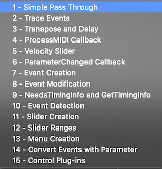

# Logic Pro Scripter Guide

The Scripter plug-in provides an interface between JavaScript code and the MIDI data of a Logic Pro channel. It allows users to create scripts that:

* Generate MIDI: like notes for chords, arpeggios. Or controls for modulation and effects.
* Transform MIDI: transpose notes, modify timing and rhythm
* Automation


## Contents

* [Background](#background)
  * [Doc Status](#doc-status)
  * [Apple's Scripter Documentation](#apples-scripter-documentation)
  * [Getting Started](#getting-started)
  * [Apple's Tutorial  Scripts](#apples-tutorial--scripts)
  * [Files and Directories](#files-and-directories)
* [Few Differences for JavaScript Developers using Scripter](#few-differences-for-javascript-developers-using-scripter)
  * [Fragility](#fragility)
  * [Not a Browser or Node.js](#not-a-browser-or-nodejs)
  * [Standard JavaScript Capabilities](#standard-javascript-capabilities)
* [Global Functions](#global-functions)
  * [`HandleMIDI(event)`](#handlemidievent)
  * [`ProcessMIDI(event)`](#processmidievent)
  * [`Trace(obj)`](#traceobj)
    * [Trimming on Trace](#trimming-on-trace)
  * [`Idle()`](#idle)
* [Scripter Objects](#scripter-objects)
  * [`Event` Object](#event-object)
    * [Event Methods](#event-methods)
    * [Event Properties](#event-properties)
    * [Event types](#event-types)
    * [Creating an `Event`](#creating-an-event)
    

## Background

### Doc Status

This documentation are updated for
* Logic Pro 10.6.2 (May 2021)

The scripts and tests were run on
* MacOS Catalina 10.15.7
* MacBook Pro (13-inch, 2020) with 2 GHz Quad-Core Intel Core i5 and 16GB memory

### Apple's Scripter Documentation

To get into the depth of Scripter, you should start with the [JavaScript objects overview](https://support.apple.com/en-au/guide/logicpro/lgcecc08451a/mac).

* Event object for MIDI events like notes and control change
* TimingInfo object: just as it says, it is timing information that you can get on a heartbeat
* Trace: utility to print to the Scripter console. Kind of a simplified `console.log()`
* MIDI object: utility to handle notes and control values

But then examples bundled with Logic Pro X reveal a lot more about what you can do. Plus they use a number of undocumented features.


### Getting Started

Script is a MIDI plug-in. Here's the quick steps to get scripter going (but there's much better doc elsewhere).

[1] In your Logic project, add a new channel and select "Software Instrument" which looks something like...


and has a blank channel strip...


[2] Add "Scripter" as a MIDI FX


[3] Two Scripter windows will open. First is the plug-in control panel which is much like any plug-in window -- except that you are able to program it. The second is the Script Editor which is the playspace for developers.


The Script Editor has two panels:

1. Top panel contains JavaScript with useful capabilities like syntax highlighting.
2. The lower panel is the Console which shows the output of the script. It's much like the console in any web browser.

A new Scripter will contain a basic script that (a) prints each MIDI event to the console with `event.trace()` (which prints a summary of the event using `Trace()`), and (b) passes through the event with `event.send()`.

The basic script development process is:
1. Load and/or Edit a script
2. Click the "Run Script" button at the top of Script Editor to activate your script (or get a bug report)
3. Monitor the script in the console. Often you'll need to start playing your track for the most interesting stuff.

### Apple's Tutorial  Scripts

Scripter comes with a set of Tutorial Scripts that show the basic functions of Script in action. These are a good to get started.



### Files and Directories

Scripter plug-in files are stored as `.pst` files which are Apple Logic plugin settings files.  These files contain your scripts, settings and other info (I'm not sure what else Logic puts in these proprietary binary files).

User script directory.  This is the default directory when you Load and Save scripts from the plug-in window.

> `~/Music/Audio Music Apps/Plug-In Setttings/Scripter`

Logic Pro script directory contains the Factory Script plug-ins that you see in the Scripter menu. Under this directory is the `Tutorial Scripts` directory.

> `/Applications/Logic Pro X.app/Contents/Resources/Plug-In Settings/Scripter`


## Few Differences for JavaScript Developers using Scripter

So you're already a decent JavaScript programmer. What's familiar or different about Scripter?

### Fragility

My impression is that Apple has not "hardened" the Scripter environment. I find it crashes easily. That is, a rogue script will instantly crash the Logic Pro app (not just scripter).

Some easy ways to crash Logic with Scripter...

* Exceed tight memory limitations
* Exceed tight time limitations
* Other crashes that I can't diagnose

The time limitations MAKE SENSE. Music is time-sensitive and delays of a few milliseconds can affect output quality. (Look below for the `Idle()` that helps with slower tasks.)

### Not a Browser or Node.js

Each JavaScript runtime has a context. JS running in a browser has access to windows, DOM and other webby things plus many critical security constraints.  Node.js has access to parts of the operating system including the file system, ability to load packages plus a different set of critical security constraints.

Scripter is a smaller environment than either the browser or node.js.

### Standard JavaScript Capabilities

Script is ES6 (EcmaScript 6).

The standard set of JavaScript features you know and love are available like...

- Class
- Date
- JSON
- Math
- Number
- RegExp
- plenty more

ES6 gives us lots of nice features compared to older variants.

* `let` and `const` declarations
* Arrow functions as shorthand: `const square = (num) => num * num;`
* Default parameter values: `const square = (num=1) => num * num;`
* rest parameter (...) allows a function to treat an indefinite number of arguments as an array. `function sum(...args) { code }`
* `for/of` loops: `for (variable of iterable) { ... }`
* JavaScript Classes
* JavaScript Promises (TODO - could these be useful in Scripter?)
* Array.find() and Array.findIndex()

BUT... there are some things you might take for granted in a browser or node.js that are not available because this is Logic.

NOT supported:
- `require` or `import`
- file reading or any OS access
- alert
- console  (use `Trace` instead)


## Global Functions

The following are the Scripter functions that integrate into the Logic Pro MIDI environment.

| Feature | Description |
| --- | --- |
| `HandleMIDI(event)` | Called with each MIDI event on the channel that is received by the plug-in. |
| `ProcessMIDI(event)` | Called periodically for regular tasks like sequencing and tempo-based effects. |
| `Trace(obj)` | Prints `obj` to the console. Only a single parameter is supported. |
| `Reset()` | Called when (a) bypass the Scripter plug-in, or (b) transport is started. No parameters |
| `Idle()` | Called during idle times when it won't get in the way of HandleMIDI() and ProcessMIDI(). Usually a few times per second. TODO - expand |


### `HandleMIDI(event)`

This function is called for every MIDI event that is received by the plug-in on the channel strip. The parameter is an [`Event`](#event) object (described below in detail) but can be any of:

* Note On
* Note Off
* Control Change
* Program Change
* Poly Pressure
* Channel Pressure
* Pitch Bend
* Target Event

`HandleMIDI()` allows the processing MIDI events:

* Print them for debug
* Modify the event (e.g. change pitch or velocity)
* Ignore events
* Add events (e.g. arpeggiate, add chords)

It is optional to implement this function. If omitted, Logic will pass through the event unmodified.

Examples:

```
// Pass MIDI events through the plug-in with modification
function HandleMIDI(event) {
    event.send();
}
```

```
// Pass MIDI events through the plug-in with modification
function HandleMIDI(event) {
  event.send();
  event.trace();
}

/*
Sample Output
[NoteOn channel:1 pitch:44 [G#1] velocity:91]
[NoteOff channel:1 pitch:44 [G#1] velocity:64]
[NoteOn channel:1 pitch:44 [G#1] velocity:91]
[NoteOn channel:1 pitch:36 [C1] velocity:91]
*/
```

Note: `event.trace()` is an alternative to `Trace(event)`;


### `ProcessMIDI(event)`

`ProcessMIDI()` enables execution of regular / periodic tasks. Examples include:

* writing a sequencer
* injecting time-based automation effects
* any tempo-related effects

`ProcessMIDI()` is called once per “process block”. Process blocks are related to the audio setup. NOTE: it is not affected by the tempo or MIDI content of your project.

Specifically, the block is the duration of an audio output buffer which is determined by the Audio settings of Logic Pro plus the Project. That is, the block size (in samples) divided by the sample rate (in Hz).

The effect is that (a) increasing the sample rate decreases the block length and (b) increasing the block size (in samples) increase the block length.

Examples:

Sample Rate | Buffer Size | Block size | Calculation | Block Freq
--- | --- | --- | --- | ---
44.1kHz | 512 samples | 0.01161sec = 11.61msec | = 512 / 44,100 | 86.13Hz
48kHz | 1024 samples | 0.02133sec = 21.33msec | = 1024 / 48,000 | 46.88Hz


`ProcessMIDI()` is not required.

`ProcessMIDI()` has no arguments.

`ProcessMIDI()` is often used in combination with the [`TimingInfo`](#timinginfo-object) object which provides timing information from Logic.

This example allows you to confirm the interval between calls to `ProcessMIDI()`. See [`scripts/processmidi-timing.js`](scripts/processmidi-timing.js)

```
/*
 * ProcessMIDI example that measures the internal
 */

let lastTime = null;

function ProcessMIDI() {
  const now = new Date().getTime();
  if (lastTime) Trace(`${now - lastTime}ms`);
  lastTime = now;
}

/*
 * Sample output
 23ms
 24ms
 23ms
 23ms
 23ms
*/
```


### `Trace(obj)`

Scripter doesn't have the `console` that you find in browsers or node. Instead it offers `Trace(obj)` to write `obj` to the Scripter console.

This is useful for status and debug. Most Logic users of your plugin won't ever see the console so don't put important stuff there.

Some things to note:

1. [Trimming](#trimming) may prevent display of some of your messages. More detail [below](#trimming).
1. Only a single parameter is accepted
2. Create your own string if you want to write multiple parameters
3. `JSON.stringify()` is available and useful
4. `Trace()` without a parameter does nothing. Use `Trace("\n")` for a blank line.

Here's a few useful ways to invoke `Trace()`. See [`scripts/trace.js`](scripts/trace.js)

```
/* Trace() examples */

// Primitives: string, number, boolean
Trace('Hello World!');

// Objects
const obj = {num: 1.2, str: 'howdy', boolean: true, arr: [5,6,7]};
Trace(obj);
Trace(JSON.stringify(obj));
Trace(JSON.stringify(obj, null, 4));

// Force some trimming
for (let i=1; i<=1000; i++) Trace("number " + i);
```

Output:

```
Hello World!
number 1
number 2
number 3
[object Object]
{"num":1.2,"str":"howdy","boolean":true,"arr":[5,6,7]}
{
    "num": 1.2,
    "str": "howdy",
    "boolean": true,
    "arr": [
        5,
        6,
        7
    ]
}
>
```

#### Trimming on Trace

Logic Pro is a time-sensitive environment. If Scripter gets too many trace requests it will trim them for performance reasons -- to avoid latency.

You will be annoyed.

```
...console bandwidth exceeded, thinning some traces...
NoteOn
...console bandwidth exceeded, thinning some traces...
```

`Dewdman42` posted a [handy work-around](https://www.logicprohelp.com/forum/viewtopic.php?t=144010) that defers the console work to the [`Idle()`](#idle) function.  Conveniently, it's named `console.log` so that you can feel at home.

See [`scripts/console.log.js`](scripts/console.log.js)

TODO: it would be good to allow printing of multiple arguments as in console.log.

```
var console = {
    maxFlush: 20,
    b:[],
    log: function(msg) {this.b.push(msg)},
    flush: function() {
        var i=0;
        while(i<=this.maxFlush && this.b.length>0) {
            Trace(this.b.shift());
            i++;
        }
    }
};

function Idle() {
    console.flush();
}

// Intead of Trace(msg) use this:
console.log("Hello World");

// Instead of event.trace() use this:
console.log(event.toString());
```


### `Idle()`

This feature is not documented by Apple but used in it's examples.

Logic Pro makes music and that's time-sensitive. Small delays introduced by your scripts could result in latency in the music creation and that's bad.

So Logic offers the `Idle()` function for housekeeping duties that might take a little longer like...

* printing to the console. e.g. [`console.log()`](#trimming-on-trace)
* updating the GUI

Your `Idle()` function is called approximately every quarter second. (I measured it at 0.265sec on my MacBook Pro but have no idea if that will vary between Logic updates or across hardware).


## Scripter Objects

### `Event` Object

Read Apple's documentation on the [Event Object](https://support.apple.com/en-au/guide/logicpro/lgce0d0efc5a/10.6.2/mac/10.15.7)

#### Event Methods

- `Event.send()`: Send the event immediately.
- `Event.sendAfterMilliseconds(delay-in-msec)`: Send the event after a specific delay (can be an integer or a floating point number).
- `Event.sendAtBeat(beat)`: Send the event at a specific beat in the host timeline. The beat is a floating-point number.
- `Event.sendAfterBeats(number beat)`: Send the event after a delay measure in beats.
- `Event.trace()`: Print the event to the console using the `Trace()` object.
- `Event.toString()`: Returns selected information about the event as a string.

#### Event Properties

- Event.toarticulationID(integer number): Sets the articulation ID from 0–254.
- Event.channel(number): Set MIDI channel 1 to 16.
- Event.beatPos: Retrieves the event’s exact beat position.

#### Event types

The Event object is a prototype for the following event types. All event types inherit the methods and channel properties described above.  The event types and their properties are passed to HandleMIDI as follows:
- NoteOn.pitch(integer number): Pitch from 1–127.
- NoteOn.velocity(integer number): Velocity from 0–127. A velocity value of 0 is interpreted as a note off event, not a note on.
- NoteOff.pitch(integer number): Pitch from 1–127.
- NoteOff.velocity(integer number): Velocity from 0–127.
- PolyPressure.pitch(integer number): Pitch from 1–127.
- PolyPressure.value(integer number): Define a pressure value from 0–127.
- ControlChange.number(integer number): Controller number from 0–127.
- ControlChange.value(integer number): Controller value from 0–127.
- ProgramChange.number(integer number): Program change number from 0–127.
- ChannelPressure.value(integer number): Aftertouch value from 0–127.
- PitchBend.value(integer number): 14-bit pitch bend value from -8192–8191. A value of 0 is center.
- TargetEvent.target(string): Create user definable MIDI CC messages or control plug-in parameters.
- TargetEvent.value(float): Sets the target value.

#### Creating an `Event`

Events can be created:
```
{
  var cc = new ControlChange;  /* make a new control change message */
  cc.number = 1;   /* set it to controller 1 (modulation) */
  cc.value = 100;   /* set the value */
  cc.send();    /* send the event */
  cc.trace();    /* print the event to the console */
}
```

Events can be modified and re-used:
```
function HandleMIDI() {
  var on = new NoteOn;   /* make a new note on */
  on.pitch = 60;   /* set its pitch to C3 */
  on.send();    /* send the note */
  var off = new NoteOff(on);  /* make a note off using the note on to initialize its pitch value (to C3) */
 off.sendAfterBeats(1);  /* send a note off one beat later */
}
```

Here's a JSON dump of the object contents...
```
{
    "detune":0,
    "pitch":36,
    "velocity":91,
    "status":144,
    "isRealtime":false,
    "data1":36,
    "data3":0,
    "data2":91,
    "channel":1,
    "port":1,
    "articulationID":0,
    "beatPos":0
}
```
