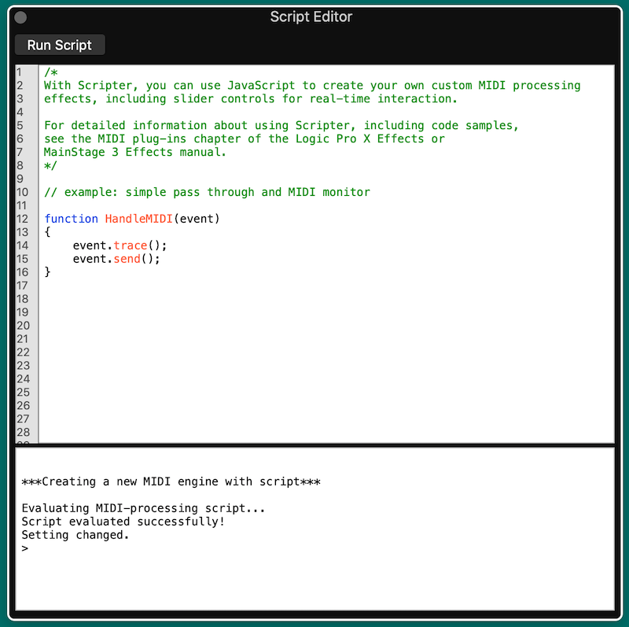

# Logic Pro Scripter Guide

The Scripter plug-in provides an interface between JavaScript code and the MIDI data of a Logic Pro channel. It allows users to create scripts that:

* Generate MIDI: like notes for chords, arpeggios. Or controls for modulation and effects.
* Transform MIDI: transpose notes, modify timing and rhythm
* Automation

## Contents

* Status
* Apple Documentation
* Getting Started
* Few Differences for Developers using Scripter
* Logic's Global Functions
* `Idle()`
* `Event` Object
 * Event Methods
 * Event Properties


## Status

This documentation are updated for
* Logic Pro 10.6.2 (May 2021)

The scripts and tests were run on
* MacOS Catalina 10.15.7
* MacBook Pro (13-inch, 2020) with 2 GHz Quad-Core Intel Core i5 and 16GB memory

## Apple Documentation

To get into the depth of Scripter, you should start with the [JavaScript objects overview](https://support.apple.com/en-au/guide/logicpro/lgcecc08451a/mac).

* Event object for MIDI events like notes and control change
* TimingInfo object: just as it says, it is timing information that you can get on a heartbeat
* Trace: utility to print to the Scripter console. Kind of a simplified `console.log()`
* MIDI object: utility to handle notes and control values

But then examples bundled with Logic Pro X reveal a lot more about what you can do. Plus they use a number of undocumented features.

## Getting Started

Script is a MIDI plug-in. Here's the quick steps to get scripter going (but there's much better doc elsewhere).

[1] In your Logic project, add a new channel and select "Software Instrument" which looks something like...


and has a blank channel strip...


[2] Add "Scripter" as a MIDI FX


[3] Two Scripter windows will open. First is the plug-in control panel which is much like any plug-in window -- except that you are able to program it. The second is the Script Editor which is the playspace for developers.




The Script Editor has two panels:

1. Top panel contains JavaScript with useful capabilities like syntax highlighting.
2. The lower panel is the Console which shows the output of the script. It's much like the console in any web browser.

A new Scripter will contain a basic script that (a) prints each MIDI event to the console with `event.trace()` (which prints a summary of the event using `Trace()`), and (b) passes through the event with `event.send()`.

The basic script development process is:
1. Load and/or Edit a script
2. Click the "Run Script" button at the top of Script Editor to activate your script (or get a bug report)
3. Monitor the script in the console. Often you'll need to start playing your track for the most interesting stuff.

## Few Differences for Developers using Scripter

**Fragility**

My impression is that Apple has not "hardened" the Scripter environment. I find it crashes easily. That is, a rogue script will instantly crash the Logic Pro app (not just scripter).

Some easy ways to crash Logic with Scripter...

* Exceed tight memory limitations
* Exceed tight time limitations
* Other crashes that I can't diagnose

The time limitations MAKE SENSE. Music is time-sensitive and delays of a few milliseconds can affect output quality. (Look below for the `Idle()` that helps with slower tasks.)

**Not a Browser or Node.js**

Each JavaScript runtime has a context. JS running in a browser has access to windows, DOM and other webby things plus many critical security constraints.  Node.js has access to parts of the operating system including the file system, ability to load packages plus a different set of critical security constraints.

Scripter is a smaller environment than either the browser or node.js.

**Standard JavaScript Capabilities**

Script is ES6 (EcmaScript 6).

The standard set of JavaScript features you know and love are available like...

- Class
- Date
- JSON
- Math
- Number
- RegExp
- plenty more

ES6 gives us lots of nice features compared to older variants.

* `let` and `const` declarations
* Arrow functions as shorthand: `const square = (num) => num * num;`
* Default parameter values: `const square = (num=1) => num * num;`
* rest parameter (...) allows a function to treat an indefinite number of arguments as an array. `function sum(...args) { code }`
* `for/of` loops: `for (variable of iterable) { ... }`
* JavaScript Classes
* JavaScript Promises (TODO - could these be useful in Scripter?)
* Array.find() and Array.findIndex()

BUT... there are some things you might take for granted in a browser or node.js that are not available because this is Logic.

NOT supported:
- `require` or `import`
- file reading or any OS access
- alert
- console  (use `Trace` instead)

## Logic's Global Functions

| Feature | Description |
| --- | --- |
| Trace(obj) | Prints `obj` to the console. Only a single parameter is supported. |
| Reset() | Called when (a) bypass the Scripter plug-in, or (b) transport is started. No parameters |
| Idle() | Called during idle times when it won't get in the way of HandleMIDI() and ProcessMIDI(). Usually a few times per second. TODO - expand |


## `Idle()`

XXX

Called during idle times when it won't get in the way of HandleMIDI() and ProcessMIDI(). Usually a few times per second.  (Measured at approx 0.265sec on Intel MacBook 2020.)
Good callback function for housekeeping duties like printing to the console, updating the GUI or other counting operations that aren't directly involved with sending midi events.


## `Event` Object

Read Apple's documentation on the [Event Object](https://support.apple.com/en-au/guide/logicpro/lgce0d0efc5a/10.6.2/mac/10.15.7)

### Event Methods

- `Event.send()`: Send the event immediately.
- `Event.sendAfterMilliseconds(delay-in-msec)`: Send the event after a specific delay (can be an integer or a floating point number).
- `Event.sendAtBeat(beat)`: Send the event at a specific beat in the host timeline. The beat is a floating-point number.
- `Event.sendAfterBeats(number beat)`: Send the event after a delay measure in beats.
- `Event.trace()`: Print the event to the console using the `Trace()` object.
- `Event.toString()`: Returns selected information about the event as a string.

### Event Properties

- Event.toarticulationID(integer number): Sets the articulation ID from 0–254.
- Event.channel(number): Set MIDI channel 1 to 16.
- Event.beatPos: Retrieves the event’s exact beat position.

Event types
The Event object is a prototype for the following event types. All event types inherit the methods and channel properties described above.  The event types and their properties are passed to HandleMIDI as follows:
- NoteOn.pitch(integer number): Pitch from 1–127.
- NoteOn.velocity(integer number): Velocity from 0–127. A velocity value of 0 is interpreted as a note off event, not a note on.
- NoteOff.pitch(integer number): Pitch from 1–127.
- NoteOff.velocity(integer number): Velocity from 0–127.
- PolyPressure.pitch(integer number): Pitch from 1–127.
- PolyPressure.value(integer number): Define a pressure value from 0–127.
- ControlChange.number(integer number): Controller number from 0–127.
- ControlChange.value(integer number): Controller value from 0–127.
- ProgramChange.number(integer number): Program change number from 0–127.
- ChannelPressure.value(integer number): Aftertouch value from 0–127.
- PitchBend.value(integer number): 14-bit pitch bend value from -8192–8191. A value of 0 is center.
- TargetEvent.target(string): Create user definable MIDI CC messages or control plug-in parameters.
- TargetEvent.value(float): Sets the target value.

Events can be created:
```
{
  var cc = new ControlChange;  /* make a new control change message */
  cc.number = 1;   /* set it to controller 1 (modulation) */
  cc.value = 100;   /* set the value */
  cc.send();    /* send the event */
  cc.trace();    /* print the event to the console */
}
```

Events can be modified and re-used:
```
function HandleMIDI() {
  var on = new NoteOn;   /* make a new note on */
  on.pitch = 60;   /* set its pitch to C3 */
  on.send();    /* send the note */
  var off = new NoteOff(on);  /* make a note off using the note on to initialize its pitch value (to C3) */
 off.sendAfterBeats(1);  /* send a note off one beat later */
}
```

Here's a JSON dump of the object contents...
```
{
    "detune":0,
    "pitch":36,
    "velocity":91,
    "status":144,
    "isRealtime":false,
    "data1":36,
    "data3":0,
    "data2":91,
    "channel":1,
    "port":1,
    "articulationID":0,
    "beatPos":0
}
```
